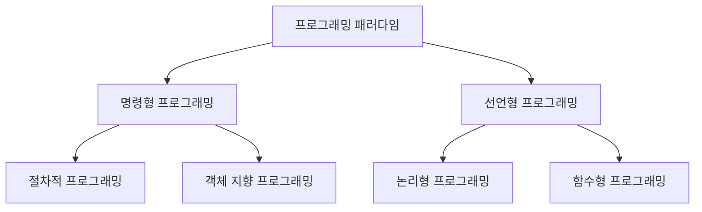

## 프로그래밍 패러다임

프로그래밍 패러다임은 프로그래머에게 프로그래밍의 관점을 갖게 해주고 결정하는 역할을 한다. 예를 들어, *객체 지향 프로그래밍*은 프로그래머들이 프로그램을 상호작용하는 객체들의 집합으로 볼 수 있게 하는 반면에, *함수형 프로그래밍*은 상태값을 지니지 않는 함수들의 연속으로 생각할 수 있게 해준다. 소프트웨어 공학의 서로 다른 무리가 서로 다른 방법론을 지원하듯이, 서로 다른 프로그래밍 언어는 서로 다른 프로그래밍 패러다임을 지원한다. 또한 특정 프로그래밍 언어는 여러 프로그래밍 패러다임을 지원한다. 예를 들어, C++은 *절차적 프로그래밍, 객체 지향 프로그래밍, 객체 기반 프로그래밍* 등을 지원하도록 설계되었다.

최근에는 여러 패러다임을 관대하게 지원되는 경향이 강하다. 자바나 PHP와 같이 본래 없던 패러다임이 추가되거나 Swift, Go, Kotlin과 같이 비교적 새로 만들어진 언어들은 처음부터 여러 패러다임의 지원을 고려하여 설계된다. 범용성을 강조하는 언어들은 최근 *함수형, 선언형 패러다임*이 적극적으로 적용되고 있다. 이처럼 상황과 맥락에 따라 패러다임간 장점만을 취하려는 시도는 계속되고 있지만, 반대로 개발자가 서로 다른 패러다임에 강점이 있거나 서로 다른 플랫폼에 기반한 여러 언어를 배워 사용하는 경우가 늘어가고 있다. 한 개발자가 여러 언어와 여러 패러다임을 익히는 것을 *Polyglotism*이라 하고, 하나의 프로젝트에서 여러 언어의 여러 패러다임을 사용하는 것을 *Polyglot* 프로그래밍이라고 한다. 기존과 달리 하나의 프로젝트를 수행하는 데 고려해야 하는 환경이 다양해지거나 특정 작업에 최적화된 여러 툴, 프레임워크, 언어가 등장하면서 문제의 복잡도와 규모가 커져가기 때문에 *Polyglot* 프로그래밍이 트렌드로 자리잡고 있다. [출처 - 위키백과](https://ko.wikipedia.org/wiki/%ED%94%84%EB%A1%9C%EA%B7%B8%EB%9E%98%EB%B0%8D_%ED%8C%A8%EB%9F%AC%EB%8B%A4%EC%9E%84)