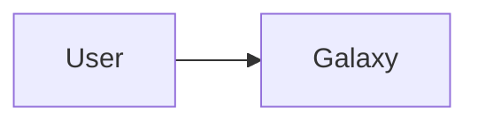
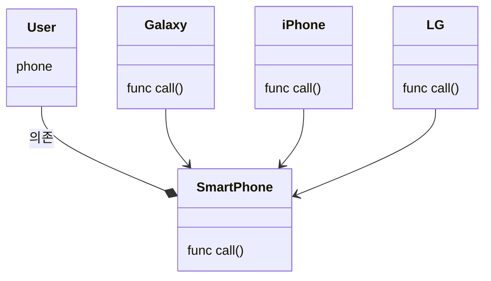

## 객체 지향 프로그래밍의 5가지 설계 원칙

객체 지향 프로그래밍에서 꼭 지켜야할 5개의 원칙을 통틀어 *객체 지향 5원칙*이라고 한다. 혹은 다섯 개 원칙의 앞글자를 따서 *SOLID*라고도 부른다. 이는 로버트 마틴이 2000년대 초반에 명명한 [*객체 지향 프로그래밍*](./object-oriented-programming.md) 및 설계의 다섯 가지 기본 원칙을 마이클 페더스가 약어로 소개한 것이다. 개발자는 *객체 지향 프로그래밍*을 적용하면서 시간이 지나도 유지 보수와 확장이 쉬운 시스템을 만드록자 할 때 이 원칙들을 함께 적용할 수 있다. *SOLID* 원칙은 소프트웨어 작업에서 프로그래머가 소스 코드를 읽거나 확장하기 쉽게 될 때까지 리팩토링 할 수 있도록 한다.

### SRP(Single Responsibility Principle)

***단일 책임 원칙***이란 '**한 클래스는 하나의 책임만 가져야 한다**'를 의미한다. *SRP* 원리를 적용하면 클래스의 책임이 변경할 때 다른 클래스에 미치는 영향을 최소화하여 클래스간의 결합도는 낮추고, 응집도를 높일 수 있다. 또한 클래스들의 책임을 적절하게 분배함으로써 코드의 가독성이 향상되며, 유지 보수가 용이해지는 이점을 누릴 수 있다. *SRP*는 다른 4가지 원칙을 적용하는 기초가 된다.

아래의 코드는 *SRP* 원칙을 지키지 않은 경우이다.

```swift
class UserSettings {
  private var user: User
  init(user: User) {
    self.user = user
  }

  func change(settings: Settings) {
    if verify() {
      // ...
    }
  }

  func verify() {
    // ...
  }
}
```

`UserSettings` 클래스는 두 가지 기능을 수행한다. 사용자를 인증하는 `verify` 기능과 인증이 유효할 때 사용자 정보를 변경할 수 있는 `change` 기능을 수행한다. 사용자와 관련된 기능을 하나의 클래스로 번들링한 것은 좋지만, 이를 두 개의 클래스로 분배하면 추후에 수정이 용이해진다. 아래는 `UserSettings` 클래스의 책임을 두 개의 클래스로 분배한 코드이다.

```swift
class UserAuth {
  private var user: User
  init(user: User) {
    self.user = user
  }

  func verify() {
    // ...
  }
}

class UserSettings {
  private var user: User
  private var auth: UserAuth
  init(user: User) {
    self.user = user
    self.auth = UserAuth(user: user)
  }

  func change(settings: Settings) {
    if auth.verify() {
      // ...
    }
  }
}
```

### OCP(Open Close Principle)

***개방 폐쇠 원칙***이란, 소프트웨어의 모든 구성요소(클래스, 모듈, 함수 등)은 '**확장에는 열려있고, 변경에는 닫혀있어야 한다**'를 의미한다. 즉, 요구사항이 변경되거나 추가돼도 기존의 구성 요소는 수정하지 않아아 하며, 기존의 구성 요소를 쉽게 확장해서 재사용할 수 있어야 한다. 로버트 마틴은 *OCP* 원리가 재사용이 가능하고 관리가 용이한 코드를 만드는 기반이며, *OCP* 원리를 가능케 하는 중요한 메커니즘은 [추상화](./object-oriented-programming.md/#4-추상화)와 [다형성](./object-oriented-programming.md/#3-다형성)이라고 설명한다. 또한 *OCP* 원리는 객체 지향의 장점을 극대화시키는 중요한 원리이다.

아래의 코드는 *OCP* 원칙을 지키지 않은 경우이다.

```swift
class Stinger: Car {
  private var name: String
  init() {
    super.init()
    self.name = "Stinger"
  }
}

class SantaFe: Car {
  private var name: String
  init() {
    super.init()
    self.name = "Santa Fe"
  }
}

class GasStation {
  private car: Car
  init(car: Car) {
    self.car = car
  }

  func refuel() {
    if car.name == "Stinger" {
      refuelGasoline(car)
    } else if car.name == "Santa Fe" {
      refuelDiesel(car)
    }
  }

  func refuelGasoline(_ car: Car) {
    // ...
  }

  func refuelDiesel(_ car: Car) {
    // ...
  }
}
```

지금은 문제가 없어 보이지만, 자동차의 종류가 많아지면 `GasStation` 클래스의 `refuel` 메서드는 `if`문으로 도배될 것이다. 또한 자동차의 종류가 늘어날 때마다 `refuel` 메서드에 `if` 분기를 추가해야 한다. 따라서 *OCP* 원칙을 지키도록 코드를 수정하여 확장에 용이하도록 변경해보자. 아래와 같이 각각의 자동차 클래스에 `refuel` 메서드를 구현하면 자동차의 종류가 늘어나도 `GasStation` 클래스의 코드는 변경하지 않아도 된다.

```swift
class Stinger: Car {
  private var name: String
  init() {
    super.init()
    self.name = "Stinger"
  }

  func refuel() {

  }
}

class SantaFe: Car {
  private var name: String
  init() {
    super.init()
    self.name = "Santa Fe"
  }

  func refuel() {

  }
}

class GasStation {
  private car: Car
  init(car: Car) {
    self.car = car
  }

  func refuel() {
    car.refuel()
  }
}
```

### LSP(the Liskov Substitution Principle)

***리스코프 치환의 원칙***이란, '**부모 클래스를 자식 클래스로 대체해도 모든 기능이 정상적으로 작동해야 한다**'를 의미한다. 이는 자식 클래스는 부모 클래스의 역할을 정확히 해내야한다는 뜻이며, 자식 클래스가 부모 클래스의 메서드를  오버라이딩(재정의)할 때 부모 클래스의 메서드가 가지고 있는 의미를 해치지 않는지 신중히 고민해야 한다.

```swift
// TODO: LSP 원칙에 대한 예시 추가
```

### ISP(Interface Segregation Principle)

***인터페이스 분리의 원칙***이란, '**클래스는 자신이 사용하지 않는 인터페이스는 구현하지 않아야 한다.**'를 의미한다. 즉 어떤 클래스가 다른 클래스에 종속될 때 가능한 최소한의 인터페이스만을 사용해야 한다는 뜻이다. *SRP* 원칙이 클래스의 단일 책임을 강조한다면, *ISP* 원칙은 인터페이스의 단일 책임을 강조한다. *ISP* 원칙은 시스템의 내부 의존성 관계를 느슨하게 하여 리팩토링, 수정을 원활하게 하도록 한다.

아래의 코드는 *ISP* 원칙을 지키지 않은 경우이다.

```swift
protocol MultifunctionPrinter {
  func copy()
  func scan()
  func fax()
}

class Fax: MultifunctionPrinter {
  func copy() {

  }

  func scan() {

  }

  func fax() {

  }
}
```

위 `MultifunctionPrinter`는 복합기의 기능인 복사, 출력, 팩스에 대한 인터페이스이다. 그리고 `Fax`는 복합기 인터페이스의 `fax()`를 사용하기 위해 `MultifunctionPrinter`를 준수한다. 이때 `Fax`는 `copy()`와 `scan()` 메서드를 사용하지 않지만, 복합기 인터페이스에서 두 메서드의 변화가 생기면 영향을 받을 가능성이 있다. 따라서 `MultifunctionPrinter` 인터페이스는 복사, 스캔, 팩스에 대한 세 가지 인터페이스로 분리하여 각각의 인터페이스의 변경에 대해 서로가 영향을 받지 않도록 해야한다.

### DIP(Dependency Inversion Principle)

***의존성 역전의 원칙***이란, '**상위 모듈이 하위 모듈에 의존하는 전통적인 의존 관계를 반전시킴으로써, 상위 모듈이 하위 모듈의 구현으로부터 독립되어야 한다**'를 의미한다. *DIP* 원칙의 예를 살펴보자. 현재 한 명의 사람이 존재하고 갤럭시를 사용하고 있다.



```swift
class Galaxy {
  func call() {

  }
}

class User {
  private let phone = Galaxy()
  func call() {
    phone.call()
  }
}
```

위 코드에서 `User` 클래스는 `Galaxy` 클래스에 의존하고 있다. 그리고 `Galaxy` 클래스는 다른 인터페이스를 준수하고 있지 않는 구체적인 클래스이다. 따라서 변화에 취약하다. 만약 사용자가 갤럭시에서 아이폰으로 바꾸고 싶어한다면 코드에 상당한 변화가 필요할 것이다. 이러한 구조를 개선하기 위해 의존 관계를 역전시킬 필요가 있다. 즉 갤럭시, 아이폰과 같이 구체적인 스마트폰의 종류가 아닌, 스마트폰이라는 추상화된 인터페이스를 사용해야 한다.



`SmartPhone`이라는 추상화된 인터페이스를 `Galaxy`, `iPhone`, `LG` 각각의 클래스가 상속하고, `User`는 `SmartPhone` 인터페이스에 의존한다. 따라서 상위 모듈인 `User`가 하위 모듈인 `Galaxy`에 의존하던 관계를 반전시켜서, 상위 모듈이 하위 모듈의 구현으로부터 독립되었다. `SmartPhone` 인터페이스를 구현한 코드를 살펴보자.

```swift
protocol SmartPhone {
  func call()
}

class iPhone: SmartPhone {
  func call() {

  }
}

class Galaxy: SmartPhone {
  func call() {

  }
}

class LG: SmartPhone {
  func call() {

  }
}

class User {
  private let phone: SmartPhone
  init(phone: SmartPhone) {
    self.phone = phone
  }

  func call() {
    phone.call()
  }
}
```

`User` 클래스에서 구체적인 스마트폰의 종류가 아닌, `SmartPhone`이라는 추상화된 인터페이스를 사용한다.

