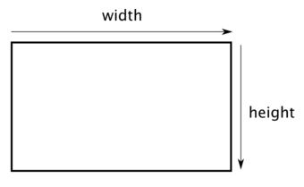
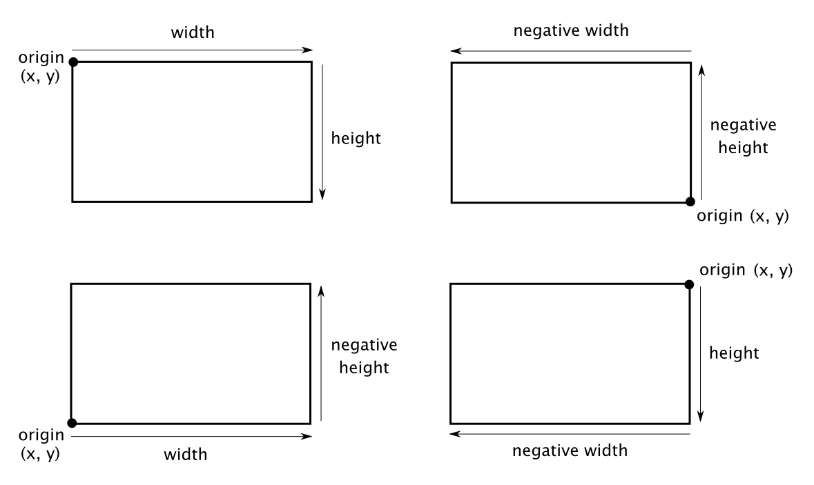

# CGSize vs CGRect

[https://zeddios.tistory.com/201](https://zeddios.tistory.com/201)

## **CGSize**



너비와 높이의 값을 포함한 구조체로, 사각형으로 간주되지 않는다.

```swift
struct CGSize {
    var width: CGFloat
    var height: CGfloat
}
```

&nbsp;
## CGRect

---


사각형의 위치와 크기를 포함한 구조체로, `CGSize`와 다르게 원점(`origin`)을 갖는다.

```swift
struct CGRect {
    var origin: CGPoint
    var size: CGSize
}
```

`CGPoint`는 x, y 좌표값을 가치고 있는 구조체로 위치를 나타낸다.

```swift
struct CGPoint {
    var x: CGFloat
    var y: CGFloat
}
```

너비와 높이의 값은 음수가 될 수 있다. 너비와 높이가 음수라는 것은 원점을 기준으로 아래와 같이 나타난다.



---