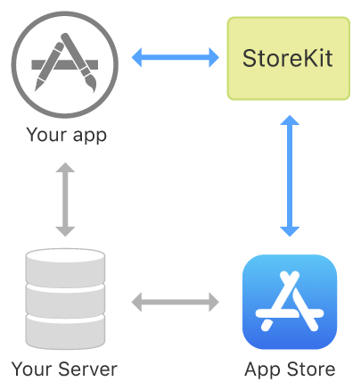

# StoreKit

인앱 결제와 앱 스토어의 상호 작용을 지원한다.

# 지원 항목

1. **인 앱 결제**
2. 사용자의 Apple Music 설정 확인, 구독 제안
3. 사용자의 앱 평가
4. Ad Network Attribution(?)

# 인앱 결제
앱을 대신하여 인앱 결제에 연결하고 결제를 처리한다.



출처: https://developer.apple.com/documentation/storekit/original_api_for_in-app_purchase

- 앱 스토어 커넥트에서 추가한 제품을 판매할 수 있고, 샌드박스 테스터의 유저 계정을 생성하여 구매 테스트를 진행할 수 있다.
- 추가 수익을 위해 새로운 유료 앱을 개발하는 대신 기존 앱에 IAP 구매를 통한 유료 컨텐츠를 추가하는 것이 바람직하다.
- **광고를 표시하는 무료 앱에서 IAP 구매를 통해 광고를 지울 수 있는 옵션을 제공할 수 있다.**
- 서버에 영수증과 구매 내역을 저장하고, 사용자가 원할 때 제공할 수 있어야 한다.

&nbsp;
## 판매할 수 있는 상품의 종류
자동 • 비 갱신 제품은 모든 사용자의 기기에서 구독을 사용할 수 있고, 사용자가 과거의 구매를 복원할 수 있도록 해야한다.

1. 소모성: 한 번 사용하면 고갈되며 여러 번 구매할 수 있다.
2. 비소모성: 만료되지 않으므로 한 번 구매한다.
3. 자동 구독 갱신: 취소하기 전까지 반복적으로 자동 갱신된다.
4. 수동 구독 갱신: 제한된 기간동안 액세스를 제공하며 자동으로 갱신되지 않는다.

&nbsp;
## 클래스

### `SKProductsRequest`
여러 제품의 ID를 사용하여 초기화하며, 지정된 제품 목록을 요청할 수 있다.

```swift
SKProductsRequest(productIdentifier: [String])
```


현재 진행 중인 결제를 시작하거나 취소할 수 있다.
```swift
productsRequest.cancel()
productsRequest.start()
```

&nbsp;
### `SKProductsRequestDelegate`
결제가 완료된 후 응답을 받는다.

```swift
func productsRequest(_ request: SKProductsRequest, didReceive response: SKProductsResponse) {
	let products: [SKProduct] = response.products
}
```

```swift
func request(_ request: SKRequest, didFailWithError error: Error) { ... }
```

&nbsp;
### `SKPaymentQueue`
앱 스토어와의 결제 과정을 처리, 관찰하고 트랜잭션을 관리한다.

```swift
let queue = SKPaymentQueue.default()
```

사용자가 결제할 수 있는지 여부를 확인할 수 있다.

```swift
let canMakePayments: Bool = queue.canMakePayments
```

구매할 상품을 추가한다.

```swift
if let product = products.first {
	let payment = SKPayment(product: product)
	SKPaymentQueue.default().add(payment)
}
```

구입한 내역 복원을 복원할 수 있다.

```swift
SKPaymentQueue.default().restoreCompletedTransactions()
```

&nbsp;
### `SKPaymentTransactionObserver`
현재 결제가 진행되고 있는 트랜잭션의 상태에 따른 처리를 할 수 있다. 트랜잭션의 상태를 관찰하기 위해 옵저버를 등록한다.

```swift
SKPaymentQueue.default().add(self)
```

옵저버를 등록하면 진행 중인 트랜잭션의 상태가 전달된다.

```swift
func paymentQueue(_ queue: SKPaymentQueue, updatedTransactions transactions: [SKPaymentTransaction] {
	for transaction in transactions {
		switch transaction.transactionState {
		case .purchased  // 구매 완료
		case .failed     // 구매 실패
		case .restored   // 구매 복원?
		case .deferred, .purchasing: // 구매 중
}
```

&nbsp;
### `SKPaymentTransaction`
결제 중인 제품의 ID 혹은 수신된 에러를 가지고 있다.

```swift
let productIdentifier = transaction.payment.productIdentifier // Optional(String)
let error = transaction.error // Optional(Error)

// 혹은 NSError로 타입 캐스팅하여 에러 코드에 따른 처리
let error = transaction.error as NSError?

if error.code != SKError.paymentCancelled.rawValue { ... }
```

복원된 제품의 ID를 확인할 수 있다.

```swift
let productIdentifier = transaction.**original?**.payment.productIdentifier // Optional(String)
```

구매가 종료되면 트랜잭션도 마찬가지로 종료시켜야 한다.

```swift
SKPaymentQueue.default().finishTransaction(transaction)
```